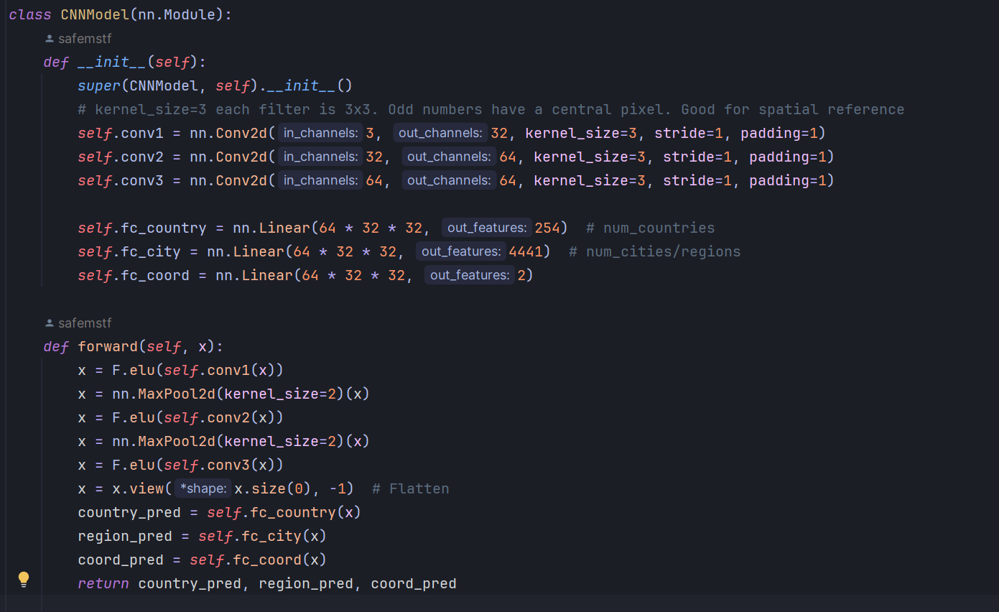

# GeoPhotoLoco
 
# Introduction
GeoPhotoLoco is a machine learning project that uses Convolutional Neural Networks (CNN) to predict the country and region, and to estimate the geographical coordinates from images. This project is designed to interpret visual data and provide geographical insights, making it a tool for geotagging and location-based analysis.

# Requirements
- Python 3+
- PyTorch 2.1.1+
- CUDA (for GPU acceleration)
- Additional Python libraries as specified in requirements.txt

# Installation
1. Clone the repository to your local machine.
2. Install required packages: pip install -r requirements.txt
3. Importing Images and Metadata Processing
4. Place your images in the designated folder.
5. Ensure metadata CSV is in the correct format with columns for image keys, coordinates, etc.
   - The format of metadata.csv: idx,key,lon,lat,...
   - Use config file to add inputs and specify outputs
6. Run the metadata processing script: python image_renamer.py

# Image Processing
Images are processed into tensors representing RGB pixel values.
Each image is assigned unique keys based on region, country ID from metadata. 
- Images can then be processed in ImageProcessor.py.
- You can use ImageProcessorChecker.py to see what the images look like after processing.

# Neural Network Training
The neural network is trained to predict location data from image tensors.
- To start training: python train.py

# Evaluation and Logging
The model's performance is evaluated using accuracy, precision, recall, and F1 score metrics.
Logs are generated for each training session, stored in training.log.

# Details of the Neural Network Architecture
The CNN model consists of convolutional layers followed by fully connected layers.
Outputs predictions for country, region, and coordinates.

# Contributions
- 
